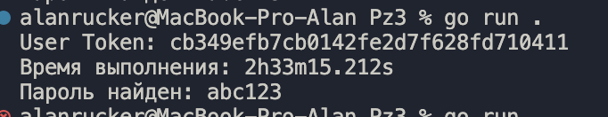
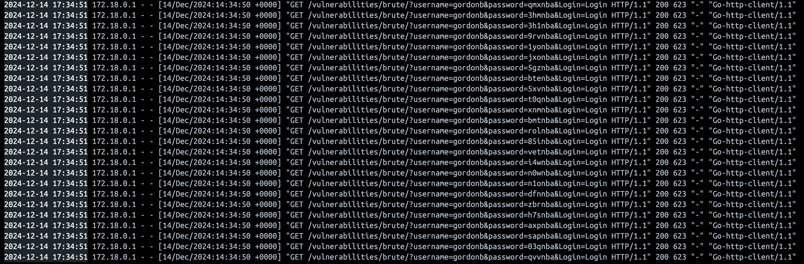

## Как с этим работать

- Для начала необзодимо в докере запустить [DVWA](https://github.com/digininja/DVWA). Для поднятия используется следующая команда:
```
docker compose up -d
```
- Далее необходимо зайти в панель администратора, перейдя по ссылке `http://localhost:4280`. Это нужно чтобы достать текущую сессию. ее необходимо вставить в файл main.go 
```
[20] cookie      = "PHPSESSID={CURRENT_SESSION_ID}; security=low"
```
- Далее запускаем программу `go run .`

## Результат



Так же во время выполнения программы можно наблюдать как проходят запросы в консоле DVWA в докере:


## Ревью кода

```
<?php

if( isset( $_GET[ 'Login' ] ) ) {
	// Get username
	$user = $_GET[ 'username' ];
	// Get password
	$pass = $_GET[ 'password' ];
	$pass = md5( $pass );
	// Check the database
	$query  = "SELECT * FROM `users` WHERE user = '$user' AND password = '$pass';";
	$result = mysqli_query($GLOBALS["___mysqli_ston"],  $query ) or die( '<pre>' . ((is_object($GLOBALS["___mysqli_ston"])) ? mysqli_error($GLOBALS["___mysqli_ston"]) : (($___mysqli_res = mysqli_connect_error()) ? $___mysqli_res : false)) . '</pre>' );
	if( $result && mysqli_num_rows( $result ) == 1 ) {
		// Get users details
		$row    = mysqli_fetch_assoc( $result );
		$avatar = $row["avatar"];
		// Login successful
		$html .= "<p>Welcome to the password protected area {$user}</p>";
		$html .= "";
	}
	else {
		// Login failed
		$html .= "<pre><br />Username and/or password incorrect.</pre>";
	}
	((is_null($___mysqli_res = mysqli_close($GLOBALS["___mysqli_ston"]))) ? false : $___mysqli_res);
}
?>
```
### SQL-инъекция (CWE-89)
В строке: 
```
$query  = "SELECT * FROM `users` WHERE user = '$user' AND password = '$pass';";
```
значения $user и $pass напрямую подставляются в SQL-запрос. Это создает возможность для выполнения SQL-инъекции, если злоумышленник передаст в параметре username вредоносный SQL-код, например:
```
username=admin' OR '1'='1
```
username=admin' OR '1'='1

### Криптографическая уязвимость: слабый алгоритм хэширования (CWE-327)

Использование md5 для хэширования паролей устарело и небезопасно. MD5 подвержен атакам по поиску коллизий и быстрому перебору. Это позволяет злоумышленникам легко вычислить хэши с помощью радужных таблиц или атак грубой силы.

### Отсутствие валидации входных данных (CWE-20)

Значения параметров $_GET['username'] и $_GET['password'] не проверяются перед использованием. Это может привести к таким проблемам, как:
- Инъекции (SQL, XSS и др.).
- Некорректную работу приложения.

### Рендеринг непроверенного контента (CWE-79: Reflected XSS)

Строка:
```
$html .= "";
```
подразумевает, что содержимое переменной $avatar безопасно. Однако, если значение в базе данных было внедрено злоумышленником, это приведет к внедрению XSS. Например:
```
<script>alert('XSS')</script>
```

### Прямое использование глобальных переменных (CWE-676)

Использование глобальной переменной $GLOBALS["___mysqli_ston"] делает код трудночитаемым и создает дополнительные риски. Если это подключение к базе данных, то его можно передавать явно как параметр функции или использовать объектно-ориентированный подход.

### Уязвимость раскрытия ошибок (CWE-209)

В случае ошибки SQL выводится полный текст ошибки:
```
or die('<pre>' . ((is_object($GLOBALS["___mysqli_ston"])) ? mysqli_error($GLOBALS["___mysqli_ston"]) : (($___mysqli_res = mysqli_connect_error()) ? $___mysqli_res : false)) . '</pre>');
```
Это может дать злоумышленнику полезную информацию о структуре базы данных или сервере.

### Фиктивное завершение соединения (CWE-404)
Строка:
```
((is_null($___mysqli_res = mysqli_close($GLOBALS["___mysqli_ston"]))) ? false : $___mysqli_res);
```
выполняет закрытие соединения с базой данных вручную, что излишне. Современные драйверы MySQL автоматически закрывают соединение при завершении выполнения скрипта.

### Хранение пользовательских данных без проверки (CWE-915)

Переменная $avatar извлекается из базы данных и передается напрямую в HTML, что представляет угрозу безопасности (например, XSS).

### Как исправить

Для защиты от данных атак, а так от брутфорса.

```
<?php
// Мапа для хранения данных о попытках входа
$loginAttempts = [];

// Максимальное количество попыток входа
define('MAX_ATTEMPTS', 5);

// Время блокировки в секундах
define('BLOCK_TIME', 300); // 5 минут

// Функция для очистки устаревших записей
function clearOldAttempts(&$attemptsMap) {
    $currentTime = time();
    foreach ($attemptsMap as $ip => $data) {
        if (($currentTime - $data['last_attempt']) > BLOCK_TIME) {
            unset($attemptsMap[$ip]);
        }
    }
}

// Подключение к базе данных через объектно-ориентированный MySQLi
$mysqli = new mysqli('localhost', 'username', 'password', 'database');

// Проверяем подключение
if ($mysqli->connect_error) {
    die('Database connection error: ' . $mysqli->connect_error);
}

// Проверяем, была ли отправлена форма входа
if (isset($_GET['Login'])) {
    // Очищаем устаревшие записи о попытках
    clearOldAttempts($loginAttempts);

    // Получаем и фильтруем входные данные
    $user = filter_input(INPUT_GET, 'username', FILTER_SANITIZE_STRING);
    $pass = filter_input(INPUT_GET, 'password', FILTER_SANITIZE_STRING);

    // Получаем IP-адрес пользователя
    $ip_address = $_SERVER['REMOTE_ADDR'];

    // Проверяем, есть ли записи о данном IP
    if (!isset($loginAttempts[$ip_address])) {
        $loginAttempts[$ip_address] = [
            'attempts' => 0,
            'last_attempt' => time(),
        ];
    }

    // Проверяем количество попыток
    if ($loginAttempts[$ip_address]['attempts'] >= MAX_ATTEMPTS) {
        if ((time() - $loginAttempts[$ip_address]['last_attempt']) <= BLOCK_TIME) {
            die("Too many failed login attempts. Please try again later.");
        } else {
            // Сбрасываем данные после истечения времени блокировки
            $loginAttempts[$ip_address]['attempts'] = 0;
        }
    }

    // Хэшируем пароль для сравнения
    $hashed_pass = password_hash($pass, PASSWORD_BCRYPT);

    // Подготавливаем запрос для предотвращения SQL-инъекций
    $stmt = $mysqli->prepare("SELECT * FROM `users` WHERE user = ? AND password = ?");
    $stmt->bind_param("ss", $user, $hashed_pass);
    $stmt->execute();

    // Получаем результат
    $result = $stmt->get_result();

    if ($result->num_rows === 1) {
        // Сбрасываем данные об IP при успешном входе
        unset($loginAttempts[$ip_address]);

        // Получаем данные пользователя
        $row = $result->fetch_assoc();
        $avatar = htmlspecialchars($row['avatar'], ENT_QUOTES, 'UTF-8');

        // Выводим приветствие
        echo "<p>Welcome to the password protected area, {$user}</p>";
        echo "";
    } else {
        // Логируем неудачную попытку входа
        $loginAttempts[$ip_address]['attempts']++;
        $loginAttempts[$ip_address]['last_attempt'] = time();

        // Сообщение об ошибке входа
        echo "<pre><br />Username and/or password incorrect.</pre>";
    }

    // Закрываем соединение
    $stmt->close();
}

$mysqli->close();
?>
```

Здесь для защиты от атак ввида брутфорса предполагается что есть мапа, которая хранит данные о том сколько неудачных попыток входа совершил юзер по данному айпи. Если пользователь 5 раз введет логин или пароль неверный, то это приведет к блокировке входа на 5 минут. Это значительно усложнит подбор пароля. 
